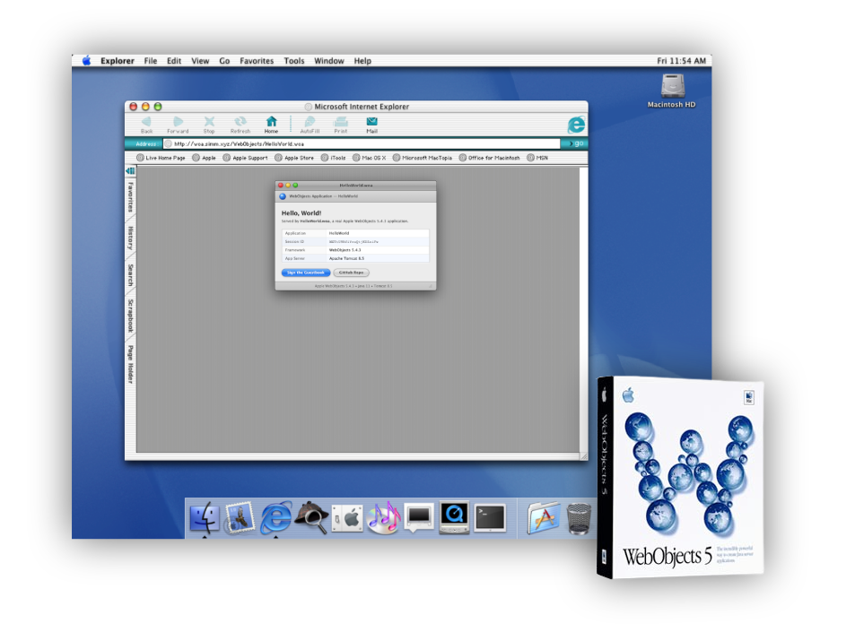

# HelloWorld.woa

<p align="center">
  
</p>

A real, honest-to-goodness **Apple WebObjects 5.4.3** application running in a Docker container. Not a simulation. Not a tribute band. The actual JAR files, the actual NSBundle lookup, the actual `.wo` template files — all of it, running on your laptop in the year of our lord 2026.

## What even is WebObjects?

[WebObjects](https://en.wikipedia.org/wiki/WebObjects) was Apple's (and originally NeXT's) enterprise Java web framework from the late 1990s. Before Rails, before Django, before Spring MVC, there was WebObjects — and it was genuinely ahead of its time. It had object-relational mapping, component-based HTML templates with two-way KVC bindings, and a session management system that would look familiar to anyone who's used modern frameworks.

Apple used it to power the Apple Store and iTunes Store for years. Then they quietly discontinued it around 2008. The JARs live on, preserved by the [WOCommunity](https://wocommunity.org/) folks, and apparently they still run just fine on Java 11.

This project proves it.

## What's in here

- A **HelloWorld.woa** that serves a real WebObjects response with live session IDs and WO headers
- A **classic guestbook** backed by a real database, with server-side form validation, persistent entries, and a visitor counter — all styled to match the Mac OS X Panther Aqua aesthetic
- A **live app stats page** surfacing real JVM internals: heap usage with a color-coded progress bar, GC collector name and pause time, loaded class count, thread counts, system load average, and WebObjects session tracking
- A **Docker Compose** setup so the whole thing spins up with one command

## Running it

You need Docker. That's it.

```bash
docker compose up --build -d
```

Then open [http://localhost:1085](http://localhost:1085). Tomcat redirects you straight to `HelloWorld.woa`.

> Port 1085 is the traditional default WebObjects port — same as the old days.

Want to watch the WO startup logs? They're glorious:

```bash
docker compose logs -f
```

To stop:

```bash
docker compose down
```

## The stack

| Layer | Technology | Vibe |
|-------|-----------|------|
| Web framework | Apple WebObjects 5.4.3 | 1999 |
| App server | Tomcat 8.5 | 2016 |
| Database | HSQLDB 2.7 | Early 2000s Java apps |
| Build | Maven 3.9 | Still going strong |
| Runtime | Java 11 | The LTS era |
| Container | Docker | Modern enough |

The database is **HSQLDB** — a pure-Java embedded database that was everywhere in early-2000s Java enterprise apps. No separate container, no service to manage; it just writes files to `./data/guestbook/` and persists across restarts.

🏆 _We tried FrontBase for maximum retro points. FrontBase's website is running a broken WebObjects app. The JDBC driver appears to have been erased from the internet. The x86 Docker image crashes during initialization on Apple Silicon. FrontBase wins the award for most retro by actually being inaccessible._

## The guestbook

The real highlight. Sign it.

[http://localhost:1085/WebObjects/HelloWorld.woa](http://localhost:1085/WebObjects/HelloWorld.woa) → click the guestbook link.

Entries persist in `./data/guestbook/` (bind-mounted into the container), so your messages survive restarts and you can inspect or back up the raw HSQLDB files any time. Just like a real 1999 guestbook server that somehow never gets rebooted.

## The stats page

Click **View App Stats** on the main page to see a live dashboard pulled straight from the JVM management beans and WebObjects internals — uptime, heap usage, GC pause time, loaded class count, thread counts, system load average, and session tracking. It's the kind of thing that would have lived behind a password-protected `/admin` link in 2003.

[http://localhost:1085/WebObjects/HelloWorld.woa](http://localhost:1085/WebObjects/HelloWorld.woa) → click View App Stats.

## How it actually works

WebObjects in servlet mode is not simple to set up. The framework has specific expectations:

- It runs in **WOROOT mode**, where it looks for a `.woa` filesystem bundle at `/opt/woapps/HelloWorld.woa/`. The bundle has to exist with `Contents/Resources/<ComponentName>.wo/` directories for template lookup to work.
- The `WOClasspath` in `web.xml` **must** be newline-separated. The tokenizer uses `\r\n` as its delimiter, not `:`. A colon-separated path on Linux is treated as one giant token and the whole thing breaks.
- Application classes have to be in `WEB-INF/lib/HelloWorld.jar` (for the servlet classloader) AND in the `.woa` bundle path (for bundle detection). Two copies, two purposes.

It took a while to figure all this out. The [CLAUDE.md](CLAUDE.md) has the gory details if you want them.

🤔 Curious about those wild-looking URLs (`/wo/qatqoDY6ea29X0I4B1Jodw/0.7`)? [DEMYSTIFYING_WEBOBJECTS_URLS.md](DEMYSTIFYING_WEBOBJECTS_URLS.md) breaks down every segment.

## Project structure

```
src/main/java/
  Application.java        WO application entry point; tracks session count
  Main.java               Default page component
  GuestbookPage.java      Guestbook component (form + validation + entry list)
  GuestbookDB.java        HSQLDB data access (singleton)
  GuestbookEntry.java     Data bean
  StatsPage.java          Live stats component (JVM + WO + guestbook metrics)

src/main/resources/
  Main.wo/                Hello World template + bindings
  GuestbookPage.wo/       Guestbook template + bindings
  StatsPage.wo/           Stats dashboard template + bindings
  Properties              WO app config
  Info.plist              Bundle metadata

src/main/webapp/
  index.jsp               Redirects / → HelloWorld.woa
  WEB-INF/web.xml         Servlet config + WOClasspath

Dockerfile                Multi-stage: Maven build → Tomcat
docker-compose.yml        Single service, port 1085, bind-mounts ./data/guestbook
data/guestbook/           HSQLDB database files (gitignored, .keep tracks the dir)
```
